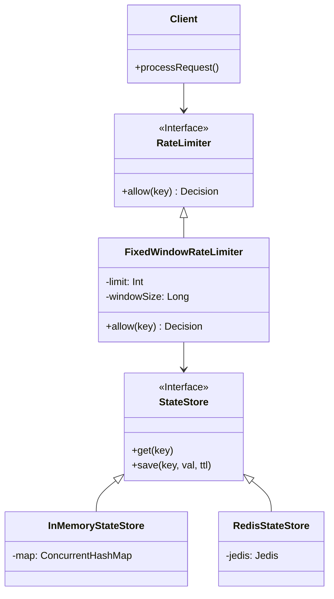

# High Level Design: Rate Limiter Library

## 1. Problem Statement
Design a flexible and scalable Rate Limiter component to throttle traffic based on defined rules. The component must support different algorithms (strategies) and storage backends (in-memory, Redis, etc.) without changing the client code.

## 2. Requirements

### Functional Requirements
- **Allow/Deny**: Return a boolean decision indicating if a request is allowed.
- **Retry Metadata**: If denied, return the time-to-wait (`retryAfterMs`) before the next attempt.
- **Configurability**: Support configurable limits (requests per unit time) and window sizes.
- **Pluggability**: Easily switch between rate limiting algorithms (Fixed Window, Sliding Window Log, Token Bucket).
- **Storage Agnostic**: Support switching between local (in-memory) and distributed (Redis/Memcached) state management.

### Non-Functional Requirements
- **Low Latency**: The rate limiting check should add minimal overhead (< 5ms).
- **High Availability**: The limiter should essentially never fail open unless configured to do so on error.
- **Scalability**: Must support horizontal scaling when using a shared state store.
- **Thread Safety**: Must handle concurrent requests correctly.

## 3. System Architecture

The system follows a **Strategy Pattern** for algorithms and a **Repository Pattern** for state management.

### Core Components

1.  **RateLimiter Interface (`core`)**:
    - The facade used by clients.
    - Method: `allow(key: String): Decision`

2.  **StateStore Interface (`core`)**:
    - Abstraction for data persistence.
    - Methods: `get`, `save`, `delete`.
    - Implementations: `InMemoryStateStore` (Single Node), `RedisStateStore` (Distributed - *Planned*).

3.  **Strategies (`strategies/*`)**:
    - Specific implementations of the `RateLimiter` interface.
    - Example: `FixedWindowRateLimiter`, `SlidingWindowRateLimiter`.

### Component Diagram (Conceptual)

## 4. Data Flow

1.  **Client** calls `RateLimiter.allow(userId)`.
2.  **RateLimiter** calculates the current window key (e.g., `userId:17000001`).
3.  **RateLimiter** queries **StateStore** for the current count.
4.  **StateStore** returns the current state.
5.  **RateLimiter** applies logic:
    - If `count >= limit`: Return `Decision(allowed=false, retryAfter=...)`.
    - If `count < limit`: Increment count in **StateStore** and return `Decision(allowed=true)`.

## 5. Trade-offs

| Strategy | Pros | Cons |
| :--- | :--- | :--- |
| **Fixed Window** | Memory efficient, easy to implement. | Spike at edges (2x traffic possible at window boundaries). |
| **Sliding Window Log** | High accuracy. | High memory usage (stores timestamp per request). |
| **Sliding Window Counter** | Balanced accuracy and memory. | More complex implementation. |
| **Token Bucket** | Handles bursts, smooths traffic. | Complex to implement distributedly without race conditions. |

## 6. Future Extensibility
- **Distributed Lock**: To prevent race conditions in read-modify-write cycles for strict counting (optional, trades latency for accuracy).
- **Async/Reactive**: Support for non-blocking I/O (e.g., Project Reactor/Coroutines) for the `StateStore` to handle network I/O efficiently.
